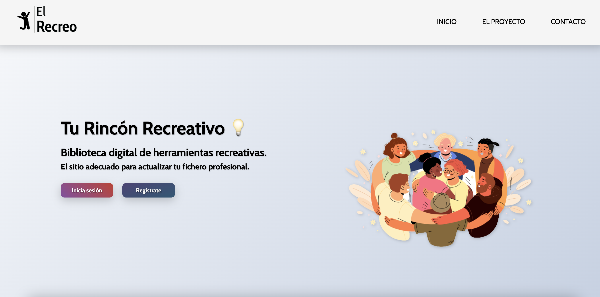

<h1 align="start"> &#129337; El Recreo</h1> 

<h3 align="start">Stack Languages and Tools:</h3> 

Landin Page institucional creada como futuro proyecto personal.

Este proyecto lo presenté como trabajo integrador del módulo de Diseño Web  perteneciente a la carrera de programación Full Stack (NUCBA)
Si bien es un proyecto simple, marca mis inicios en la programación y la práctica con HTML5 y CSS, pilares actuales para mi. 

 

<h3>Características del proyecto:</h3>

- <b>Diseño Responsive:</b> Todas las páginas son adaptables a diferentes dispositivos.
- <b>Menú Hamburguesa:</b> navegación adaptable a resoluciones móviles, funcional mediante <b>CSS y HTML5.</b>
- Utilización de <b>animaciones</b> para darle dinamismo a la landing.
- Conexión CDN a <b>Google Fonts</b> para la personalización de fuentes

<h4>&#129309; Diseño del proyecto:</h4>

- Diseño de logo buscando trasmitir mediante una imagen clara el vínculo entre El Recreo y el ludismo / bienestar.
- Selección de imágenes y paleta de colores + colores de acento.

<h4>&#128248; Screens:</h4>

Hero

 
Página de inicio de sesión

 
Cards informativas

  
&#128073; El proyecto está desplegado en Vercel y puedes encontrarlo <a href="https://el-recreo.vercel.app/index.html" target="_blank" rel="noopener noreferrer">aquí</a>.